## 基本说明
前端：myfrontend
后端：mybackend
编辑器：vscode
## 前端配置
### 安装node.js
node版本：v16.13.1
npm版本：8.1.2
[官方下载地址](https://nodejs.org/en/blog/release/v16.13.1)
[参考教程](http://t.csdnimg.cn/kGXTz)

### 安装依赖
进入前端目录，在终端输入命令
```
npm install
```

### 运行项目
在项目终端输入命令
```
npm run serve
```

## 后端配置
### 创建虚拟环境
进入后端目录，在终端输入命令
```
python -m venv myenv
```

安装项目依赖
```
pip install -r requirements.txt
```

### 配置django环境
安装下图所示的django插件
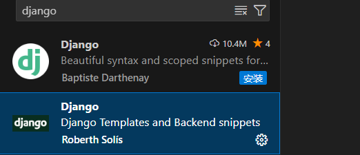

配置调试环境
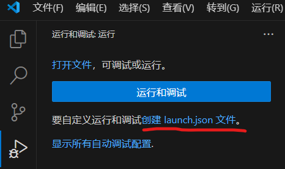

复制以下内容到launch.json
```JSON
{
    "version": "0.2.0",
    "configurations": [
        {
            "name": "Python 调试程序: Django",
            "type": "debugpy",
            "request": "launch",
            "args": [
                "runserver"
            ],
            "django": true,
            "autoStartBrowser": false,
            "program": "${workspaceFolder}\\mybackend\\manage.py"
        }
    ]
}
```

### 数据库配置
先创建一个数据库，然后配置settings\.py
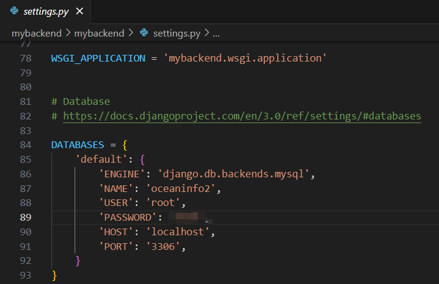
要修改的字段
- NAME：数据库名称
- USER：用户名
- PASSWORD：密码
- HOST：一般都是本地localhost

数据迁移，在项目终端输入命令
```
python manage.py makemigrations

python manage.py migrate
```

### 创建管理员
在项目终端输入命令
```
python manage.py createsuperuser
```

根据提示输入相关信息

然后再输入命令
```
python manage.py makemigrations

python manage.py migrate
```

### 运行项目
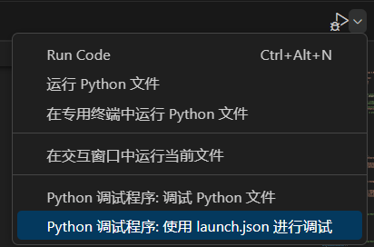

## 运行效果
浏览器访问运行前端后终端显示的地址
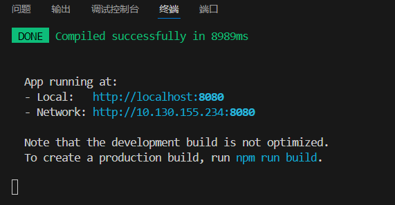
普通用户界面
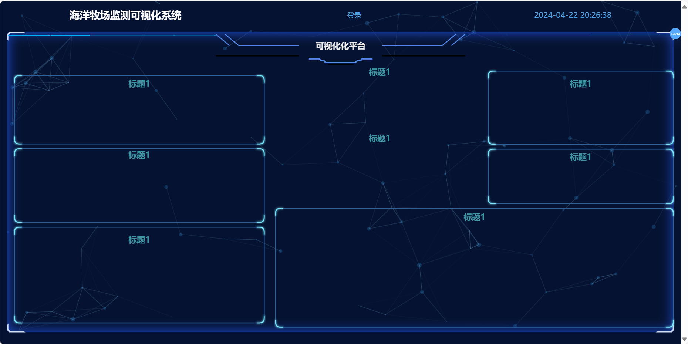
登录界面
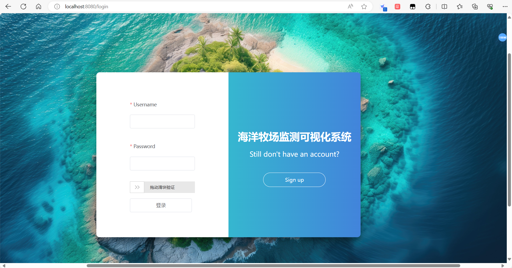
注册界面
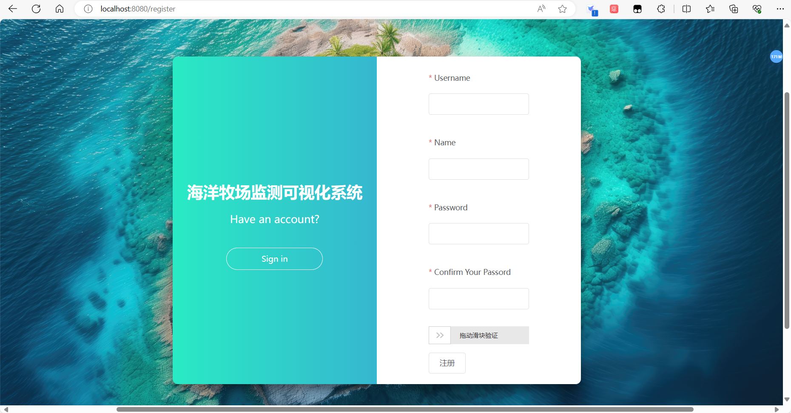
养殖户界面
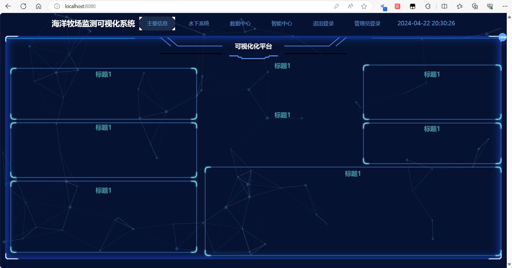
管理员登录界面
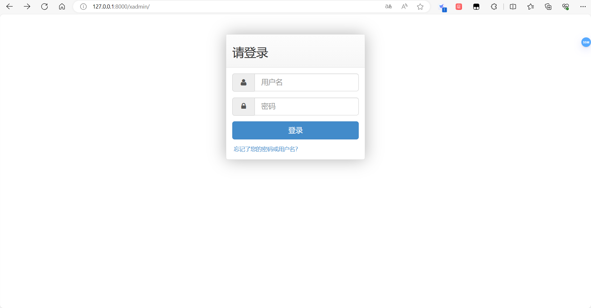
管理员界面
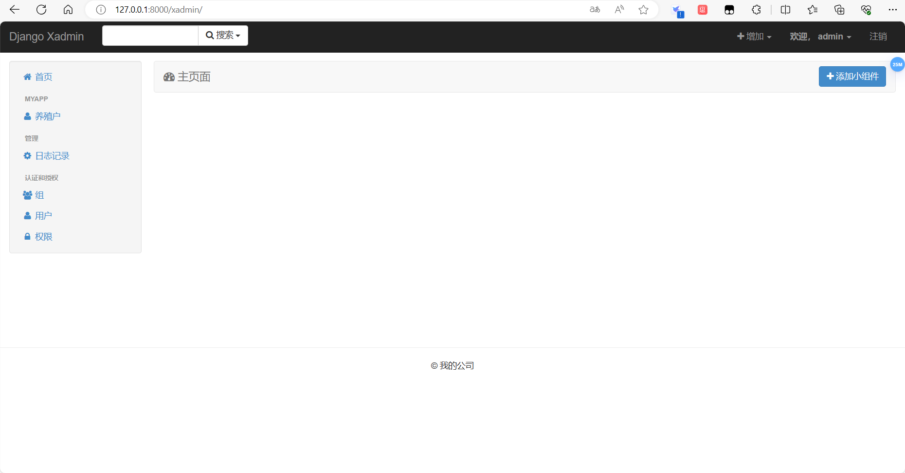