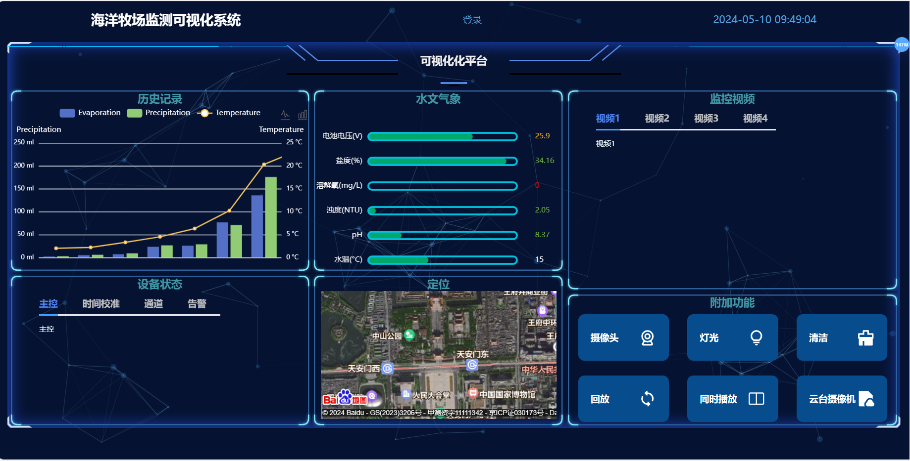
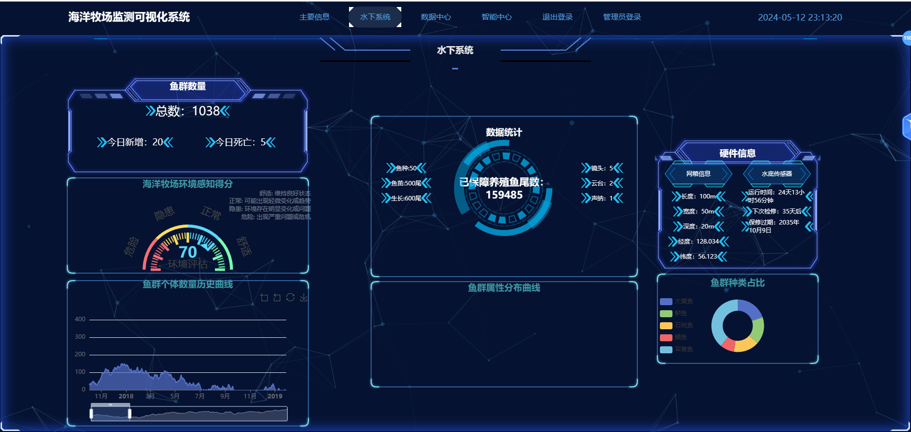

## 基本说明
前端：myfrontend

后端：mybackend

编辑器：vscode
## 前端配置
### 安装node.js
node版本：v16.13.1

npm版本：8.1.2

[官方下载地址](https://nodejs.org/en/blog/release/v16.13.1)

[参考教程](http://t.csdnimg.cn/kGXTz)

### 安装依赖
进入前端目录，在终端输入命令
```
npm install
```

### 运行项目
在项目终端输入命令
```
npm run serve
```

## 后端配置
### 创建虚拟环境
新建一个文件夹，把整个后端文件夹复制进去


在vscode中打开刚建的文件夹和终端，输入命令
```
python -m venv myenv
```

创建完成后，重新启动终端，以激活虚拟环境


把仓库里的Lib文件夹复制到刚才新建的虚拟环境myenv目录下，替换原有的Lib


### 配置django环境
安装下图所示的django插件


### 数据库配置
先创建一个数据库，然后配置settings\.py


要修改的字段

- NAME：数据库名称
- USER：用户名
- PASSWORD：密码
- HOST：一般都是本地localhost

数据迁移，在项目终端输入命令
```
python manage.py makemigrations

python manage.py migrate
```

### 创建管理员
在项目终端输入命令
```
python manage.py createsuperuser
```

根据提示输入相关信息

然后再输入命令
```
python manage.py makemigrations

python manage.py migrate
```

### 运行项目
打开manage\.py，点击调试按钮


后端运行成功效果如下，访问终端显示网址即可进入后端


## 运行效果
浏览器访问运行前端后终端显示的地址


普通用户界面



登录界面


注册界面


主要信息


水下系统



数据中心


智能中心


管理员登录界面


管理员界面

